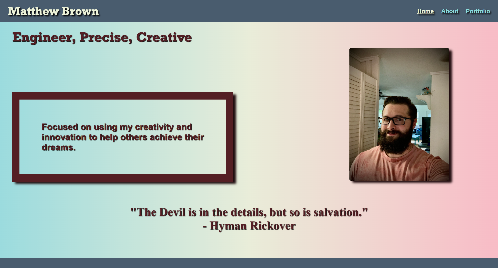
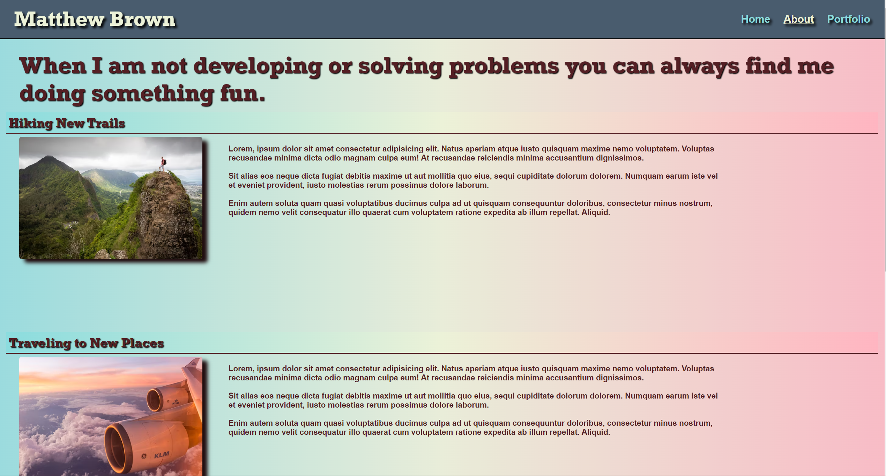
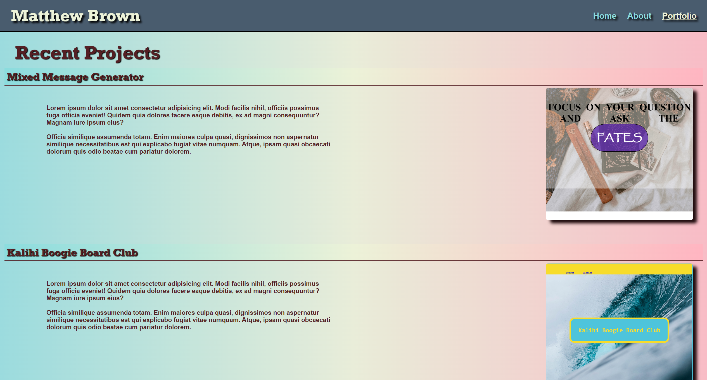

# My Personal Website

## Description

I created this website to showcase my skills, a few of my projects that I have completed, and introduce myself to potential employers or clients.  This website has three (3) pages to it:
- A Home Page
- An About Me Page
- A Portfolio Page

## Usage

To access the website use the following link:

https://mj-brown.github.io/personal_website/

or go to my GitHub to view the code:
mj-brown/personal_website

### Home Page
```md

```
This is an example of the homepage.
```md

```
This is an example of the about page.
```md

```
This is an example of the portfolio page.
